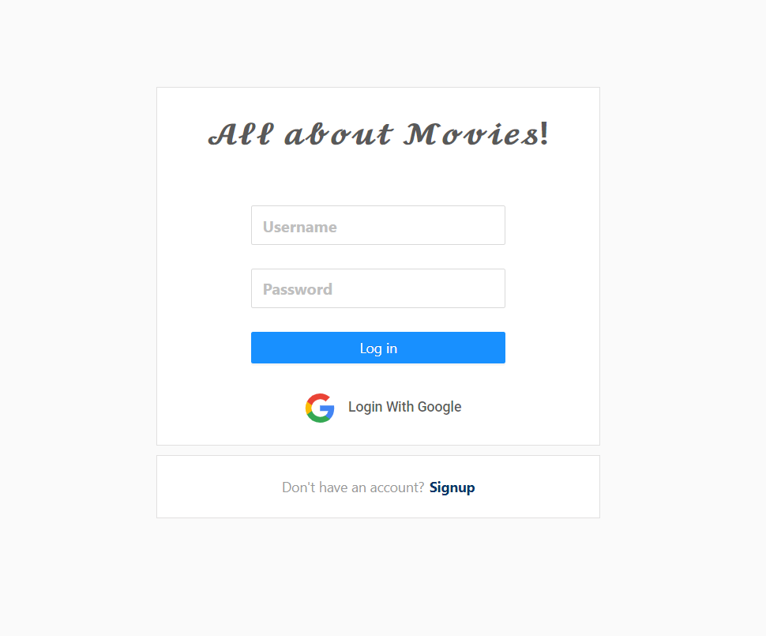
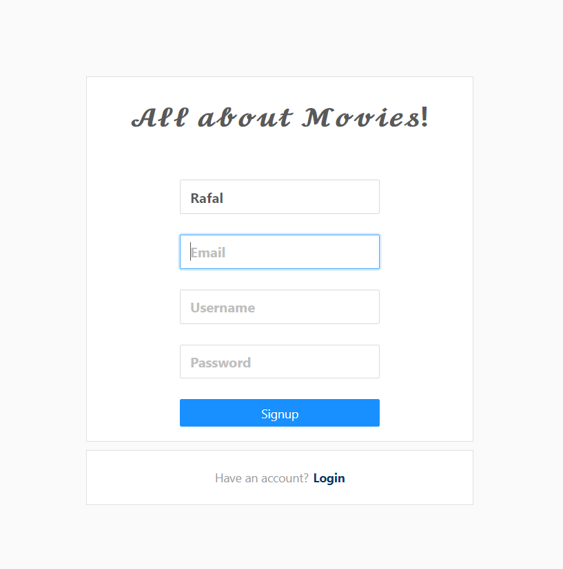
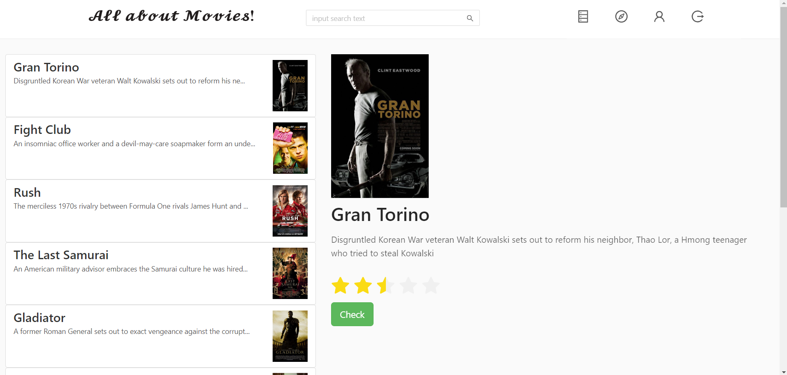
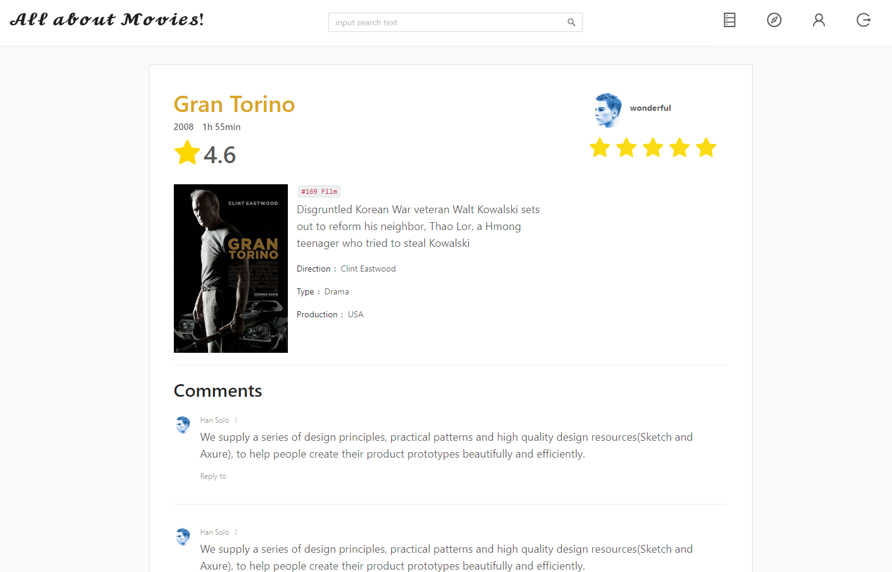
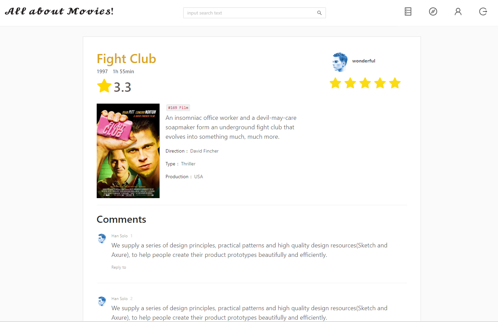
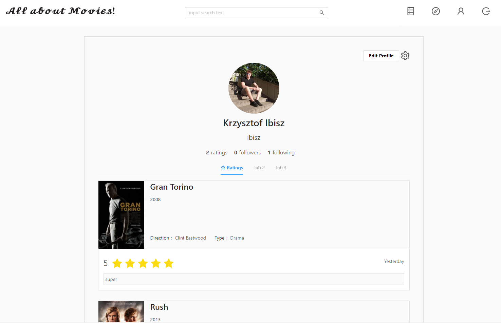

# Movie Database

> Database of films using micro-services (not finished - look at the issues)

## Important
Configuration Server provides needed configuration for the rest of services. You should run it first.
Additional, you have to set your own path to the `config-repo` folder (in the application.properties, this folder has to be a git repository). In my case:
```
spring.cloud.config.server.git.uri=file:///${user.home}/config-repo
```

## Data
You can use command from `init.data` file in order to initialize mongo database.

## App















